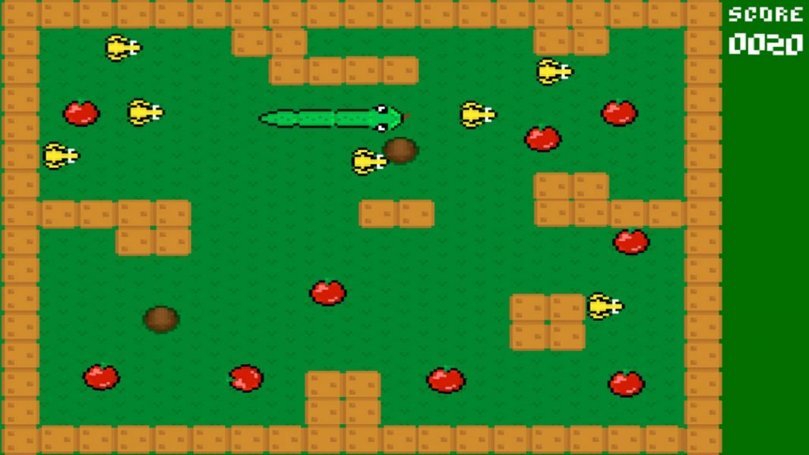

## Lab 8

Learn tutorial:
* https://coderslegacy.com/python/python-pygame-tutorial/
* https://coderslegacy.com/python/pygame-tutorial-part-2/
* https://coderslegacy.com/python/pygame-tutorial-part-3/

Basically, your task is to create snake game with next functionality:
1. Checking for border (wall) collision and whether the snake is leaving the playing area
2. Generate random position for food, so that it does not fall on a wall or a snake
3. Add levels. For example, when the snake receives 3-4 foods or depending on score 
4. Increase speed when the user passes to the next level
5. Add counter to score and level
6. Comment your code

